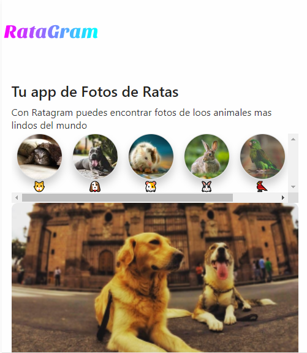

# Ratagram🐹

Ratagram is an app in which you can register and see the animals that you like the most to add them to your favorites, very similar to instagram.

I invite you to visit it https://ratagram.now.sh

## Steps
If you want to test it in development, first of all, install all the dependencies with the versions that specify the project, then you have to open the api of the categories https://ratagram-server.now.sh/categories and then open the project by middle of the script that appears in the package.json

## How it works?
-The application is instagram-based, as soon as you enter the home you will be able to see some categories in which there are images housed in an API, then the images included within each category are in an API that is available to everyone (https: // ratagram-server.now.sh/categories).

-You can register and authenticate as in any other application, it will only be for a time given to the way the application was made, but you can enjoy the photos and register again whenever you want.

-Once inside and with a registered user you can bookmark the photos that you like the most and like them to carry out the event.
